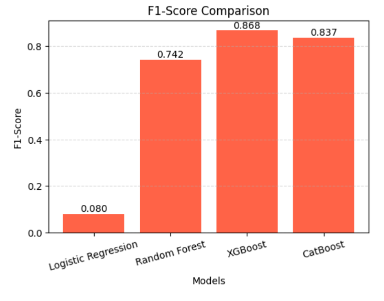

# FraudShield 🛡️

<p>
  
  
  
  
  
  
  
</p>

FraudShield is an end-to-end machine learning application for credit card fraud detection. It combines an XGBoost classifier, a FastAPI inference service, and a React frontend to deliver real-time fraud predictions with feature-level explanations powered by SHAP.

The repository contains the complete machine learning workflow, including model development, evaluation, deployment, and an interactive web interface for real-time inference and visualization.

---

## Why I Built This


Credit card fraud detection is a well-established machine learning problem, yet many implementations conclude with model training and offline evaluation. FraudShield was built to extend this workflow into a complete end-to-end application by integrating model serving, real-time inference, and prediction explainability.

A key objective of the project was to make model predictions interpretable rather than returning only a classification result. By integrating SHAP into the inference pipeline, every prediction is accompanied by feature-level explanations that improve transparency and support model analysis.

---

## What It Does

FraudShield provides an interactive interface for submitting transactions, generating real-time fraud predictions, and inspecting model explanations through a FastAPI-powered inference service.

The application currently supports:

- **Real-time fraud prediction** using a persisted XGBoost model.
- **Feature-level explainability** using SHAP.
- **Interactive model evaluation** through ROC and Precision-Recall curve visualizations.
- **Model performance reporting** using evaluation metrics generated during testing.
- **Simulated transaction scoring** using the production inference pipeline.
- **Responsive dashboard** with support for both light and dark themes.

The frontend is responsible for user interaction and visualization, while the backend handles request validation, preprocessing, model inference, explainability, and response generation.

---


## Screenshots

<table align="center">
<tr>
<td align="center" width="100%">


**Exploratory Data Analysis**

</td>
</tr>
</table>

<br>

<table align="center">
<tr>

<td align="center" width="50%">


**SHAP Explainability**

</td>

<td align="center" width="50%">


**ROC & Precision-Recall Curves**

</td>

</tr>
</table>

<br>

<table align="center">
<tr>

<td align="center" width="50%">



**Model Comparison**

</td>

<td align="center" width="50%">


**Prediction Interface**

</td>

</tr>
</table>

## Model Development & Selection

| Stage | Implementation |
| :----- | :------------- |
| **Exploratory Data Analysis** | Analyzed feature distributions, class imbalance, and feature relationships to guide preprocessing and model selection. |
| **Preprocessing** | Applied One-Hot Encoding for categorical features, Standard Scaling for numerical features, and integrated preprocessing using `ColumnTransformer`. |
| **Training Pipeline** | Built reusable `scikit-learn` Pipelines to combine preprocessing and model training into a unified workflow. |
| **Baseline Model** | Established Logistic Regression as the baseline classifier for comparative evaluation. |
| **Model Benchmarking** | Compared Logistic Regression, Random Forest, XGBoost, and CatBoost using a consistent preprocessing pipeline. |
| **Evaluation Metrics** | Assessed model performance using Precision, Recall, F1-Score, ROC-AUC, and Confusion Matrix, accounting for class imbalance. |
| **Final Model Selection** | Selected XGBoost based on its superior validation performance and overall generalization. |

---

## Technology Choices

Each major component in FraudShield was selected to address a specific stage of the machine learning inference pipeline.

| **Component**              | **Role in FraudShield** |
| :------------------------- | :---------------------- |
| **XGBoost**                | Core classification model responsible for fraud prediction. |
| **FastAPI**                | Serves the trained model through REST endpoints and validates incoming requests. |
| **Scikit-learn Pipeline**  | Applies the preprocessing pipeline used during training before inference. |
| **SHAP**                   | Computes feature attributions for individual predictions. |
| **React**                  | Provides an interactive interface for submitting transactions and visualizing results. |
| **Vite**                   | Frontend development server and build tool. |
| **Pandas & NumPy**         | Handle data manipulation and numerical operations. |
| **Joblib**                 | Loads the persisted preprocessing pipeline and trained model during inference. |

---

## System Architecture

FraudShield follows a client-server architecture that separates user interaction from machine learning inference. The React frontend manages user input and visualization, while the FastAPI backend handles request validation, preprocessing, model inference, and explainability.

```text
                          User
                            │
                            ▼
                 React Frontend (Vite)
                            │
                    HTTP / JSON Request
                            │
                            ▼
                  FastAPI Inference API
                            │
        ┌───────────────────┼───────────────────┐
        │                   │                   │
        ▼                   ▼                   ▼
 Request Validation   Preprocessing      XGBoost Model
    (Pydantic)      (Scikit-learn)        Inference
        │                   │                   │
        └───────────────────┼───────────────────┘
                            │
                            ▼
                  SHAP Feature Attribution
                            │
                            ▼
                    JSON Response
                            │
                            ▼
                 React Visualization Layer
```

The architecture isolates presentation from inference, allowing the frontend to remain independent of the underlying machine learning implementation while ensuring all prediction requests are processed through a centralized backend pipeline.

---

## Inference Pipeline

Every prediction request is processed through a structured backend pipeline that validates inputs, performs preprocessing, executes model inference, generates feature-level explanations, and returns the final prediction to the frontend.

### 1. Request Submission

The frontend collects transaction attributes, serializes them as JSON, and sends the request to the `/predict` endpoint.

### 2. Request Validation

FastAPI validates the incoming request using a Pydantic schema, rejecting malformed or incomplete payloads before they enter the inference pipeline.

### 3. Feature Construction

Additional attributes required by the trained model are reconstructed from reference datasets, including geographic information such as latitude, longitude, ZIP code, and city population.

### 4. Preprocessing

The completed feature vector is processed through the persisted Scikit-learn preprocessing pipeline before being passed to the classifier.

### 5. Model Inference

The trained XGBoost classifier generates both the predicted class and the corresponding fraud probability.

### 6. Model Explainability

The transformed feature vector is passed to SHAP's `TreeExplainer`, which computes feature-level explanations for the prediction. Contributions from one-hot encoded variables are mapped back to their original feature names for improved interpretability.

### 7. Response Generation

The backend returns a structured JSON response containing the predicted class, fraud probability, and the most influential features. The frontend renders these results without performing any inference locally.

---

## Model Performance

The model was evaluated on a held-out test set using metrics commonly used for binary classification on imbalanced datasets. Since fraudulent transactions represent only a small fraction of the data, model performance is assessed using multiple complementary metrics rather than overall accuracy alone.

| **Metric**            | **Score** |
| :-------------------- | --------: |
| **ROC AUC**           | **0.9993** |
| **Average Precision** | **0.9576** |
| **Precision**         | **0.9717** |
| **Recall**            | **0.8576** |
| **F1 Score**          | **0.9111** |

### Metric Overview

- **ROC AUC** evaluates the model's ability to distinguish fraudulent and legitimate transactions across all classification thresholds.
- **Average Precision** summarizes the Precision-Recall curve and provides a more informative measure than ROC AUC for highly imbalanced datasets.
- **Precision** measures how often transactions predicted as fraudulent are actually fraudulent.
- **Recall** measures the proportion of fraudulent transactions successfully detected by the model.
- **F1 Score** balances precision and recall, providing a single measure of overall classification performance.

The evaluation metrics are generated during model testing and exposed through the backend API, allowing the frontend dashboard to display the same results used during model evaluation. Additional evaluation artifacts, including the ROC Curve, Precision-Recall Curve, confusion matrix, and the complete training workflow are available in the accompanying Jupyter notebook.

---

## Repository Structure

The repository is organized into three primary components: model development, backend inference, and the frontend application.

```text
FraudShield/
├── fraudshield-backend/
│   ├── main.py
│   ├── fraud_detection_model.pkl
│   ├── model_metrics.json
│   ├── reference_data.json
│   └── requirements.txt
│
├── fraudshield-frontend/
│   ├── public/
│   ├── src/
│   ├── package.json
│   └── vite.config.js
│
└── notebooks/
    └── FraudShield_Training.ipynb
```

- **fraudshield-backend** contains the FastAPI inference service and the persisted machine learning pipeline.
- **fraudshield-frontend** contains the React dashboard used to interact with the deployed model.
- **notebooks** contains the complete training workflow, experimentation, and model evaluation.

---

## Live Deployment

| **Component**         | **Link** |
| :--------------------- | :------- |
| **Frontend**            | [fraud-shield-liard.vercel.app](https://fraud-shield-liard.vercel.app) |
| **Backend API**         | [fraudshield-sc4l.onrender.com](https://fraudshield-sc4l.onrender.com) |
| **API Documentation**   | [fraudshield-sc4l.onrender.com/docs](https://fraudshield-sc4l.onrender.com/docs)|

*Hosted on free tiers — the backend may take up to ~50 seconds to respond on first load after a period of inactivity.*

---
## Running Locally

### Clone the Repository

```bash
git clone https://github.com/<your-username>/FraudShield.git
cd FraudShield
```

### Backend Setup

```bash
cd fraudshield-backend

python -m venv venv

# Windows
venv\Scripts\activate

# macOS / Linux
source venv/bin/activate

pip install -r requirements.txt

uvicorn main:app --reload
```

### Frontend Setup

```bash
cd fraudshield-frontend

npm install

npm run dev
```

---

## Limitations

FraudShield is designed to demonstrate an end-to-end machine learning deployment workflow rather than a production fraud detection platform. The current implementation has the following constraints:

- The model has been evaluated on a publicly available dataset and has not been validated on live financial transaction streams.
- The application performs real-time inference but does not currently persist prediction history.
- Geographic features are reconstructed from reference datasets, with fallback values applied when required information is unavailable.
- User authentication, authorization, and rate limiting are not implemented.
- The live transaction feed demonstrates the inference pipeline using simulated transactions rather than production payment data.

---

## Future Improvements

Although FraudShield provides a complete end-to-end machine learning inference workflow, several enhancements could move the application closer to a production-grade fraud detection platform.

Planned improvements include:

- Containerize the application using Docker to simplify deployment and environment management.
- Introduce CI/CD pipelines for automated testing, builds, and deployments.
- Integrate PostgreSQL to persist prediction history and support historical analysis.
- Implement user authentication, authorization, and role-based access control.
- Replace the simulated transaction feed with a real-time event stream.
- Introduce asynchronous task processing for batch inference and long-running workloads.
- Add monitoring, structured logging, health checks, and observability tooling.
- Expand model evaluation using additional datasets to assess robustness and generalization.
- Implement automated model retraining and versioning as new data becomes available.

---

## Author

**Siya Malik ♡**

♡**GitHub:** https://github.com/siyamlk

♡**LinkedIn:** https://www.linkedin.com/in/siya-m-704141219/

If you have feedback, suggestions, or would like to discuss the project, feel free to open an issue or connect with me on LinkedIn.

---

<p align="center">
Thanks for stopping by ♡
</p>
